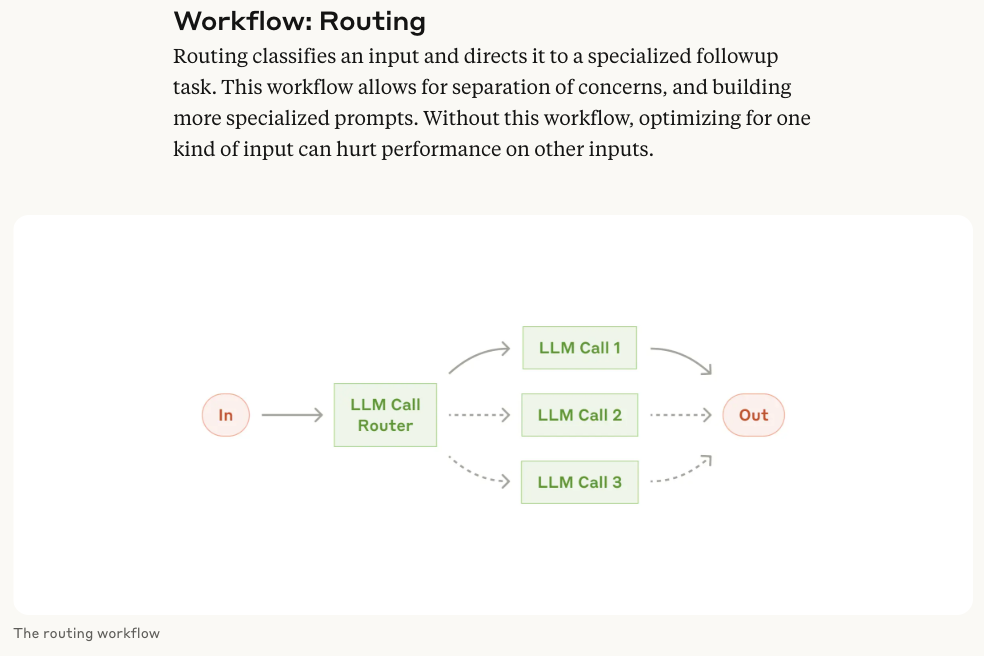

# one-novelist

> an AI playwright

## Introduce

Workflow: Routing

## TODO

- 每一位出场的角色都有自己的性格特点，身份背景。在角色第一次出场的时候请简要阐述该角色的身份背景，并简单介绍其性格特征。在角色做出了某个决定之后，描述该角色做出决定的原因：可能是因为性格，所以TA 做出了这样子的行为；也可能是因为剧情发展，所以所以TA 根据之前已经发生过的剧情自己总结后做出了决定。
- 在遵守系统给出的场景和主线剧情的基础上，将场景输入给每一位角色，每一位角色自主发挥，根据角色性格特征输出言行举止
- 还需要将某位角色的言行举止也输入到其他角色 prompt 中，其他角色在上一位角色输出的基础上进行自己的反应+言行举止，以推动剧情发展
- 将角色性格特点预定义到 SystemPrompt 中
- 剧情模块，需要：1、控制全局剧情发展；2、控制每个角色剧情发展；3、控制副本发展；
- 打斗场景，需要设计一个战斗模块，输入场景，参战双方基本信息，性格特征，所属流派，角色技能，武器属性等信息，最重要的是输入最终谁是赢家。
  战斗模块根据这些基本信息生成战斗部分内容。
- 副本模块，输入副本基本信息，参与角色，最终结果。系统根据这些信息完善副本中的场景已经内容。
- 角色模块，输入人物成长环境，基本性格特征，精简输出改角色从小到大直到出场这段时间所经历的一些比较影响性格特点的经历。比如人物为什么会形成后期这种性格，为什么会有某种行为举止。

## Reference

- https://www.anthropic.com/engineering/building-effective-agents
- https://www.zhihu.com/question/370078461